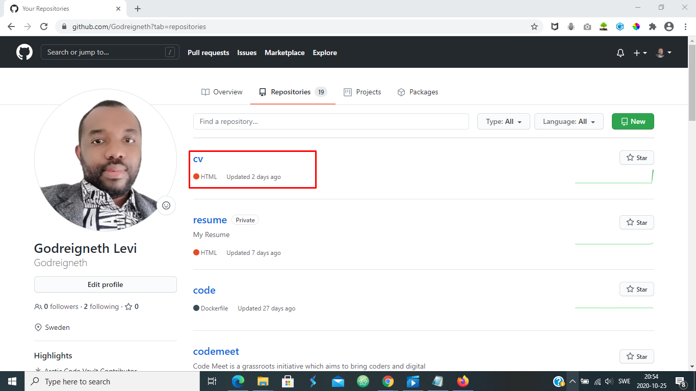

# Personal Portfolio

## A clean, beautiful and responsive portfolio made with **HTML5**, **CSS3**, and **Bootstrap 4.5**

This is a personal portfolio website, and on it's **HOME** page it provides users with my Personal Info, About Me (What Do I Do?; How I Do It?; and Why Hire Me?).

The **RESUME** page showcases my Professional Summary, Work History, Skills, Recent Projects, Education, What I am Proud Of, Language, Passion and References.

On the **CONTACT** page, there are various options that enable user to reach out through the contact form for either Job Hire, Project Work, Collaboration, Investing, or just fancy Saying Hi!.

There is form validation in **CONTACT** page, making it mandatory for user to complete the form in the right format as required before submittion. Immediately the user clicks on Send Message in the **CONTACT** page, the user is redirected to the **THANK YOU** page, that allow the user to continue by clicking to go to **HOME** page.

Finally, the **DOWNLOAD CV** section grants the user the ability to downlaod CV/Resume in pdf format for later viewing or printing.

## Demo
You can find live preview for this project [here](https://godreigneth.github.io/cv/)

## UX

This project is for any users around the globe who is looking out for a Full Stack Software Developer for either Job Hire, Project Work, Collaboration, Investing, or just fancy saying Hi!.

This Portfolio site is an extension of my résumé. It provides a convenient way for potential clients to view my work while also allowing me to expand on my education, work history, skills and services. 

It also provides the user various means of contact, either through GitHub / LinkedIn links or filling out and sending the form on the Contact page.

### User story:

- User that wants to go to the **RESUME** page from **HOME** page, can do so by clicking on the **RESUME** on the navigation bar.

- User that wants to go to the **CONTACT** page from **HOME** page, can do so by clicking on the **CONTACT** on the navigation bar.

- User that wants to go back to the **HOME** page from **RESUME**, **CONTACT**, or **THANK YOU** page; can do so by clicking on the **HOME** page in the navigation bar or the main image in the header. 

- User that wants to download resume/cv, can simply go to the  **DOWNLOAD CV** section in the navigation bar or in the footer of every page.

- User that wants go to the view Projects Live Site or Source Codes, can do that from the **RESUME** page under MY RECENT PROJECTS.

- User that wants to access the PROFESSIONAL SUMMARY, MY SKILLS, MY RECENT PROJECTS, WORK HISTORY, EDUCATION, WHAT I'M PROUD OF, LANGUAGE, and PASSION & REF.; can do so by clicking on **RESUME** page.

- User that wants to access the social media link, can do so my clicking on the prefered social media link and will be redirected accordingly.

See wireframe url [here](https://www.justinmind.com/usernote/tests/48907392/48911919/48935342/index.html#/screens/d12245cc-1680-458d-89dd-4f0d7fb22724). Justinmind protoyper was used to make the wireframe of the idea that I had for my project. From how it would look to where would text go and how many images,how many pages. Of course with going deeper into the making of project itself wireframe as such had to adapt and develop to better suit the need of the project itself.

## Features

### HEADER Section
This section contains my full name and job tittle.

### HOME Page
This page conatains my Personal Info section, and it contains the following information (Name, Address, Phone, Email and LinkedIn profile link.); and About Me section, containing the following information (What Do I Do?; How Do I Do It?; and Why Hire Me?).

### RESUME Page
This page contains my Professional Summary, My Skills, My Recent Projects, Work History, Education, What I'm Proud Of, Language, Passion and References.

### CONTACT Page
This Contact page and it's settings makes it easier for user to contact me, and the Reason/Subject option seletions simplifies it for me to be contacted either for Job Hire, Project Work, Collaboration, Investing, or someone else that facy to say Hi! to me.

### THANK YOU Page
The Thank You page is where a user is redirected to, after successfully Submiting the Contact form on the Contact page. It showcases the message "Thank you! for contacting me, I will reply promptly"; and grant the user the ability to navigate to the Home page with a Button below the message.

### DOWNLOAD CV Section
On user clicking on this section, CV/Resume in pdf format will be opened for user to view, print or download for later purpose.

### FOOTER Section
In this section, three is subsections of ABOUT, DOWNLOAD and SOCIAL (containing GitHub and LinkedIn profile links).

### Back To Top
In this section, three is subsections of ABOUT, DOWNLOAD and SOCIAL (containing GitHub and LinkedIn profile links).

## Features Left to Implement

- Open Source Projects
- Achievements And Certifications
- Blogs
- Podcast
- Connect with LinkedIn to get Summary, Skills, Education and Experience
- Add More Sections

## Technologies Used

Here are Technologies used for this project, and it's functions.

- [HTML5](https://html.spec.whatwg.org)

  - The project uses **HTML5** for it's structuring.

- [CSS3](https://www.w3.org/Style/CSS/Overview.en.html)

  - The project uses **CSS3** for it's styling.

- [Bootstrap](https://getbootstrap.com)

  - The project uses **Bootstrap** starter template, in other to quickly design and customize responsive mobile-first site.

- [Font Awesome](https://fontawesome.com)

  - The project uses **Font Awesome** to get vector icons and social logos.

- [Google Fonts](https://fonts.google.com)

  - The project uses **Google Fonts** for great Typography.

- [cdnjs](https://cdnjs.com/libraries/bootstrap-hover-dropdown)

  - The project uses **cdnjs** in other to achieve bootstrap-hover-dropdown.

- [Formspree](https://formspree.io/)

  - The project uses **Formspree** API for the contact form solution.

- [JQuery](https://jquery.com)
  - The project uses **JQuery** imported alongside Bootstrap starter template.

## Testing

Whole CSS was validated and tested through [Jigsaw/CSS](https://jigsaw.w3.org/css-validator/validator#css) Congratulations! No Error Found. This document validates as CSS level 3 + SVG ! All the HTML codes were run and tested through [HTML TESTER](https://validator.w3.org/nu/?doc=https%3A%2F%2Fgodreigneth.github.io%2Fcv%2F). This project was tested across multiple browsers and on multiple mobile devices, tablets and desktops to ensure compatibility and responsiveness.

| Test Scenario | Status |
| --- | --- |
| As a user, when they click on HOME nav link they should navigate to HOME page section | Pass |
| As a user, when they click on RESUME nav link they should navigate to RESUME page section | Pass |
| As a user, when they click on CONTACT nav link they should navigate to CONTACT page section | Pass |
| As a user, when they click on DOWNLOAD CV nav link they should navigate to my CV in .pdf format for viewing and downloading | Pass |
| As a user, when they click on my photo they should navigate to home page | Pass |
| As a user, when they click on any of social link they should navigate to social links page | Pass |
| As a user, when they click on DOWNLOAD icon next to "Download it here" in the Footer, they should navigate to my CV in .pdf format for viewing and downloading | Pass |
| As a user, when they click on Back To Top icon, they should navigate to top of the page | Pass |
| As a user, when they click on "Live Site" link on the Recent Projects, they should navigate to website page | Pass |
| As a user, when they click on "Source Code" link on the Recent Projects, they should navigate to GitHub repository page | Pass |
| As a user, when they click on "See more on GitHub" link on the Recent Projects, they should navigate to GitHub repositories page | Pass |
| As a user, when they fill out contact form and sends it, it goes through and redirect the user to the THANK-YOU page| Pass |
| As a user, when they have mouse on the nav it, there should be an hover-dropdown | Pass |

  ### Extra Contact form Testing:
   1. Go to the "Contact" page
   2. Try to submit the empty form and verify that an error message about the required fields appears
   3. Try to submit the form with an invalid email address and verify that a relevant error message appears
   4. Try to submit the form with all inputs valid and verify that a success message appears.

## Deployment

This project has been deployed through GitHub pages.

Here are different actions taken in other to get the project deployed:

- Opened up repositories on GitHub.
- Selected cv repository.
- Clicked on settings buttom.
- Scrolled down and hosted pages thorugh GitHub Pages by selecting master branch as main source.
- Wait for a while, as the project is been deployed to GitHub, and a GitHub subdomain link generated for the live project.

### In addition, below are screenshots presentation of the deployment process.

#### First Step: Opened up repositories on my GitHub.

#### Second Step: Selected cv repository.

#### Third Step: Navigate and click settings icon.

#### Forth Step: Scroll down, press dropdown button under Source section which is in GitHub Pages section, select master branch as source of your deployment.

#### Final Step: Wait a little bit, refresh the page and the site has been deployed at the link generated.

## Credits

### Content

- Some of the text in ABOUT Me and MY Skills sections was copied from the [Code Institute Resume-Miniproject-Bootstrap4](https://github.com/Code-Institute-Solutions/resume-miniproject-bootstrap4)

### Media

- Some photos and videos used in this site were obtained from <a href="https://www.shutterstock.com/" target="_blank">here</a>

### Acknowledgements

- I received inspiration for this project from [Code Institute Resume-Miniproject-Bootstrap4](https://github.com/Code-Institute-Solutions/resume-miniproject-bootstrap4) and my Mentor <a href="https://github.com/nishant8BITS" target="_blank"><strong>Nishant Kumar</strong></a>
- All of bootstrap content inside this project was taken from <a href="https://getbootstrap.com/" target="_blank">here</a>
